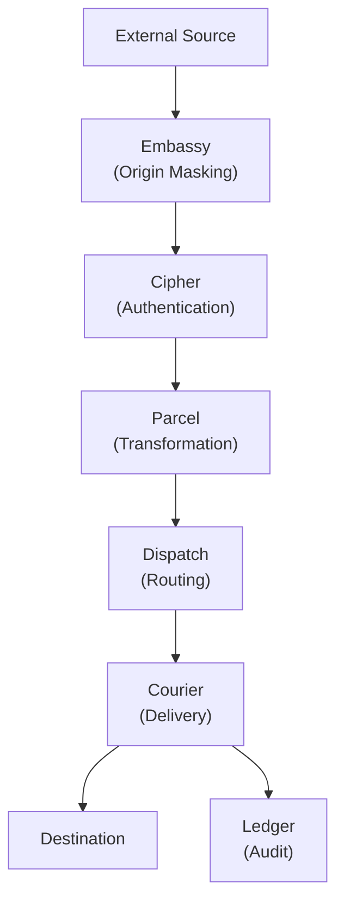
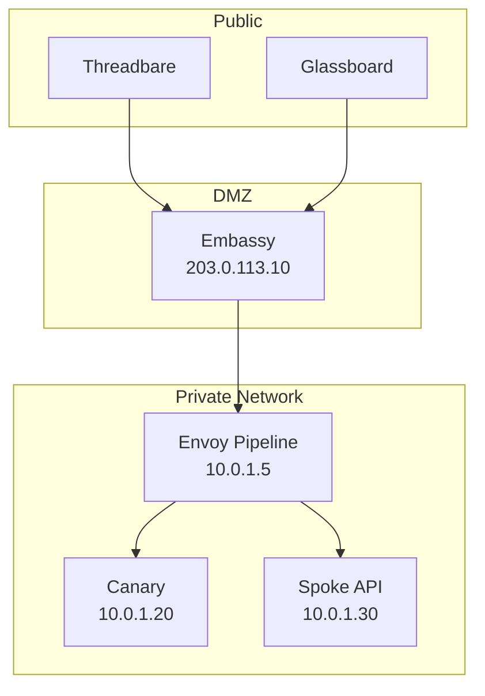
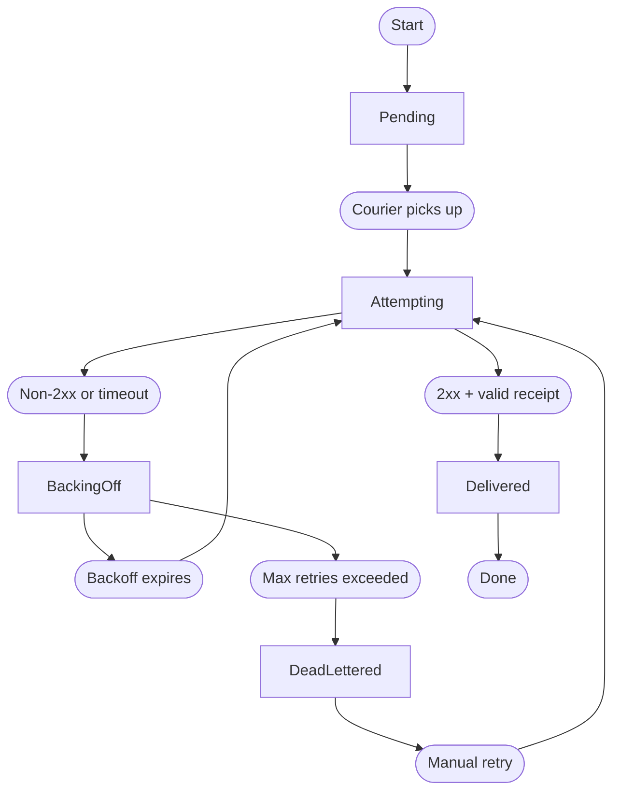

import { Terminology } from '@cbnventures/docusaurus-preset-nova/blocks';

# Architecture

<Terminology title="Protocol translator and relay engine between systems" to="/docs/terminology#envoy">Envoy</Terminology> is designed as a pipeline of discrete stages. Each stage has a single responsibility, a defined input, and a defined output. This page covers the system-level architecture, <Terminology title="Envoy's origin-masking reverse proxy exposed publicly" to="/docs/terminology#embassy">Embassy</Terminology>'s origin-masking model, <Terminology title="Envoy's guaranteed-delivery engine with retry backoff" to="/docs/terminology#courier">Courier</Terminology>'s retry state machine, and <Terminology title="Append-only audit log of every message's state" to="/docs/terminology#ledger">Ledger</Terminology>'s append-only storage.

> The best infrastructure is the kind you forget about until you need it. If you are thinking about your integration layer, it has already failed.

## Request Lifecycle

Every incoming request passes through the full pipeline:



1. **<Terminology title="Envoy's origin-masking reverse proxy exposed publicly" to="/docs/terminology#embassy">Embassy</Terminology>** receives the external request and proxies it inward. The internal service address is never exposed.
2. **<Terminology title="Envoy's authentication gateway verifying every request" to="/docs/terminology#cipher">Cipher</Terminology>** authenticates the source. Invalid requests are rejected with no further processing.
3. **<Terminology title="Envoy's payload transformation pipeline normalizing messages" to="/docs/terminology#parcel">Parcel</Terminology>** transforms the payload into the format the destination expects.
4. **<Terminology title="Envoy's routing engine deciding message destinations" to="/docs/terminology#dispatch">Dispatch</Terminology>** evaluates routing rules and selects the destination (or destinations, for <Terminology title="Delivering one message to multiple destinations at once" to="/docs/terminology#fanout">fanout</Terminology>).
5. **<Terminology title="Envoy's guaranteed-delivery engine with retry backoff" to="/docs/terminology#courier">Courier</Terminology>** delivers the message with retry guarantees.
6. **<Terminology title="Append-only audit log of every message's state" to="/docs/terminology#ledger">Ledger</Terminology>** records every state transition for the full transaction lifecycle.

## Embassy: Origin Masking

<Terminology title="Envoy's origin-masking reverse proxy exposed publicly" to="/docs/terminology#embassy">Embassy</Terminology> is <Terminology title="Protocol translator and relay engine between systems" to="/docs/terminology#envoy">Envoy</Terminology>'s reverse proxy layer. It keeps internal services completely off the public internet. External sources send requests to <Terminology title="Envoy's origin-masking reverse proxy exposed publicly" to="/docs/terminology#embassy">Embassy</Terminology>'s public endpoint. <Terminology title="Envoy's origin-masking reverse proxy exposed publicly" to="/docs/terminology#embassy">Embassy</Terminology> forwards them to the internal <Terminology title="Protocol translator and relay engine between systems" to="/docs/terminology#envoy">Envoy</Terminology> pipeline. The destination service — whether <Terminology title="Uptime monitoring service used as an example destination" to="/docs/terminology#canary">Canary</Terminology>, a <Terminology title="HTTP API Envoy exposes for relay management" to="/docs/terminology#spoke">Spoke</Terminology> endpoint, or any other internal system — never receives traffic from outside the network.



<Terminology title="Envoy's origin-masking reverse proxy exposed publicly" to="/docs/terminology#embassy">Embassy</Terminology> terminates TLS using Ironclad certificates, validates the request format, and strips headers that could leak internal topology. The forwarded request contains only the payload and the authentication headers needed by <Terminology title="Envoy's authentication gateway verifying every request" to="/docs/terminology#cipher">Cipher</Terminology>.

### Embassy Configuration

```text title="relay.grain — Embassy block"
embassy {
  listen      = "0.0.0.0:443"
  tls_cert    = "/etc/envoy/ironclad/cert.pem"
  tls_key     = "/etc/envoy/ironclad/key.pem"
  upstream    = "http://10.0.1.5:8090"
  strip_headers = ["X-Forwarded-For", "X-Real-IP"]
}
```

## Courier: Retry State Machine

<Terminology title="Envoy's guaranteed-delivery engine with retry backoff" to="/docs/terminology#courier">Courier</Terminology> manages the delivery lifecycle for every message. Each message transitions through a defined set of states:



| State         | Description                                                                                                                                                                                  | Ledger Entry  |
|---------------|----------------------------------------------------------------------------------------------------------------------------------------------------------------------------------------------|---------------|
| Pending       | Message queued, waiting for <Terminology title="Envoy's guaranteed-delivery engine with retry backoff" to="/docs/terminology#courier">Courier</Terminology> to pick up.                      | `queued`      |
| Attempting    | Delivery in progress. <Terminology title="Envoy's guaranteed-delivery engine with retry backoff" to="/docs/terminology#courier">Courier</Terminology> is waiting for a response.             | `attempting`  |
| Delivered     | Destination returned 2xx with a valid receipt. Transaction complete.                                                                                                                         | `delivered`   |
| Backing Off   | Delivery failed. <Terminology title="Envoy's guaranteed-delivery engine with retry backoff" to="/docs/terminology#courier">Courier</Terminology> is waiting before the next attempt.         | `retrying`    |
| Dead-Lettered | All retry attempts exhausted. Message moved to <Terminology title="Terminal state after Courier's retries are exhausted" to="/docs/terminology#dead-letter">dead-letter</Terminology> queue. | `dead_letter` |

### Delivery Receipts

<Terminology title="Envoy's guaranteed-delivery engine with retry backoff" to="/docs/terminology#courier">Courier</Terminology> does not consider a 2xx response sufficient for delivery confirmation. The response body must match the expected receipt schema for the destination protocol. A 200 from a reverse proxy with an empty body is not a confirmed delivery — it is an acknowledgement that the proxy received the bytes.

## Ledger: Audit Storage

<Terminology title="Append-only audit log of every message's state" to="/docs/terminology#ledger">Ledger</Terminology> is an append-only log that records every state transition for every message. Nothing is updated in place. Nothing is deleted (until the retention policy expires).

```text title="Ledger entries for a single message"
[ledger] msg_f7a2b8c4  queued       (relay: threadbare-pushes)
[ledger] msg_f7a2b8c4  attempting   (attempt: 1/5, destination: canary://ci-builds)
[ledger] msg_f7a2b8c4  delivered    (latency: 3.1ms, receipt: confirmed)
```

### Retention Policies

| Policy    | Retention | Storage Impact | Use Case                                                                                                                                                       |
|-----------|-----------|----------------|----------------------------------------------------------------------------------------------------------------------------------------------------------------|
| Minimal   | 24 hours  | Low            | High-throughput <Terminology title="Single declared pipeline from a source to destinations" to="/docs/terminology#relay">relays</Terminology>, ephemeral data. |
| Standard  | 30 days   | Moderate       | Most production deployments.                                                                                                                                   |
| Extended  | 1 year    | High           | Compliance and audit requirements.                                                                                                                             |
| Permanent | Unlimited | Very high      | Forensic and legal hold.                                                                                                                                       |

```text title="relay.grain — Ledger retention"
ledger {
  retention = "30d"
  export {
    format   = "json"
    schedule = "daily"
    target   = "spoke://audit.internal/ingest"
  }
}
```

## Next Steps

- [API Reference](/docs/reference/api-reference/) — Query <Terminology title="Append-only audit log of every message's state" to="/docs/terminology#ledger">Ledger</Terminology> entries, inspect <Terminology title="Envoy's guaranteed-delivery engine with retry backoff" to="/docs/terminology#courier">Courier</Terminology> state, and manage <Terminology title="Single declared pipeline from a source to destinations" to="/docs/terminology#relay">relays</Terminology> via the <Terminology title="HTTP API Envoy exposes for relay management" to="/docs/terminology#spoke">Spoke</Terminology> API.
- [Configuration](/docs/setup/configuration/) — Full <Terminology title="Config file declaring every relay Envoy runs" to="/docs/terminology#relay-manifest-grain">relay manifest</Terminology> reference including <Terminology title="Envoy's origin-masking reverse proxy exposed publicly" to="/docs/terminology#embassy">Embassy</Terminology> and <Terminology title="Append-only audit log of every message's state" to="/docs/terminology#ledger">Ledger</Terminology> blocks.
