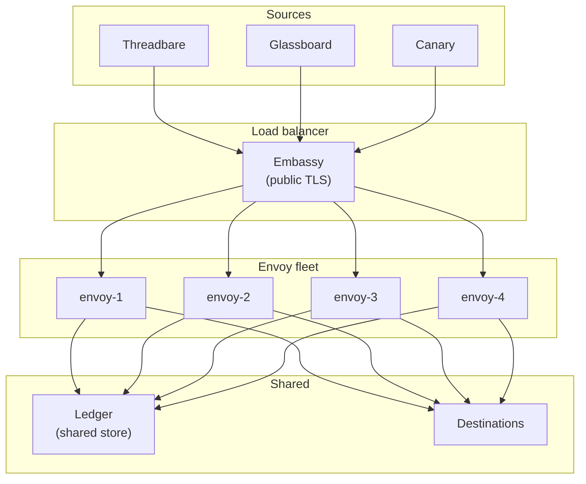
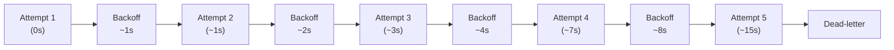
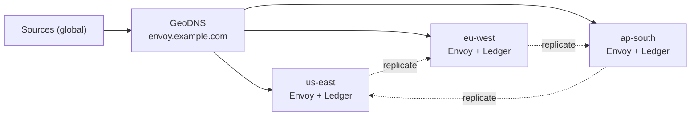

import { Terminology } from '@cbnventures/docusaurus-preset-nova/blocks';

# Scaling Relays

A single <Terminology title="Protocol translator and relay engine between systems" to="/docs/terminology#envoy">Envoy</Terminology> <Terminology title="Container image format Envoy ships as" to="/docs/terminology#vial">Vial</Terminology> handles thousands of messages per second on commodity hardware. The interesting failures begin somewhere past that — when one region goes dark, when one destination starts rate-limiting, or when one topic suddenly receives a hundred times the traffic of the other ninety-nine. This page covers how to size, shard, and replicate <Terminology title="Protocol translator and relay engine between systems" to="/docs/terminology#envoy">Envoy</Terminology> so the cluster outlives any single component.

> Scale is not a target. It is a consequence of correct sharding.

## Horizontal Topology

<Terminology title="Protocol translator and relay engine between systems" to="/docs/terminology#envoy">Envoy</Terminology> scales horizontally by adding instances behind a load balancer. Every instance is stateless except for the <Terminology title="Append-only audit log of every message's state" to="/docs/terminology#ledger">Ledger</Terminology>, which is shared. <Terminology title="Orchestrated cluster deployment target for Envoy" to="/docs/terminology#trellis">Trellis</Terminology> orchestrates instance lifecycle, while <Terminology title="CLI used to install and run Envoy" to="/docs/terminology#spark">Spark</Terminology> deploys identical configurations to every node.



Every instance authenticates, transforms, routes, and delivers independently. <Terminology title="Append-only audit log of every message's state" to="/docs/terminology#ledger">Ledger</Terminology> writes are append-only — no contention, no coordination.

:::info
<Terminology title="Envoy's origin-masking reverse proxy exposed publicly" to="/docs/terminology#embassy">Embassy</Terminology> must front the entire fleet. Putting <Terminology title="Envoy's origin-masking reverse proxy exposed publicly" to="/docs/terminology#embassy">Embassy</Terminology> behind the load balancer instead of in front of it would expose internal IPs in failure responses. The order matters.
:::

## Sharding by Topic

Round-robin load balancing works until one topic absorbs more traffic than the rest of the fleet combined. The fix is topic-aware sharding: every instance owns a deterministic subset of topics.

```text title="relay.grain — topic sharding"
sharding {
  strategy = "topic-hash"
  shards   = 4

  // highlight-start
  assignment {
    "envoy-1" = ["ci-builds", "deploy-alerts"]
    "envoy-2" = ["infra-alerts", "oncall-urgent"]
    "envoy-3" = ["monitoring", "project-updates"]
    "envoy-4" = ["fanout-default"]
  }
  // highlight-end
}
```

| Strategy        | Use Case                                  | Trade-off                                            |
|-----------------|-------------------------------------------|------------------------------------------------------|
| Round-robin     | Uniform topic traffic, small fleets       | One hot topic overwhelms one instance.               |
| Topic-hash      | Predictable assignment, no coordination   | Rebalancing requires config push.                    |
| Consistent-hash | Large fleets, frequent membership changes | Slight imbalance under skew.                         |
| Manual          | Hot-topic isolation, regulatory pinning   | Operator must update assignments when traffic moves. |

<Terminology title="Orchestrated cluster deployment target for Envoy" to="/docs/terminology#trellis">Trellis</Terminology> handles rebalancing during membership changes — when an instance joins or leaves the fleet, <Terminology title="Orchestrated cluster deployment target for Envoy" to="/docs/terminology#trellis">Trellis</Terminology> recomputes assignments and pushes updated `.grain` snippets through <Terminology title="CLI used to install and run Envoy" to="/docs/terminology#spark">Spark</Terminology>.

## Tuning Courier's Retry Budget

<Terminology title="Envoy's guaranteed-delivery engine with retry backoff" to="/docs/terminology#courier">Courier</Terminology>'s retry budget is the policy that decides when to keep trying and when to give up. The defaults are conservative — they assume an HTTP destination that occasionally times out. Aggressive destinations (rate-limited APIs, paging services with strict SLAs) need a tighter budget.

```text title="relay.grain — Courier retry budget"
courier {
  retry {
    max_attempts    = 5
    initial_backoff = "1s"
    max_backoff     = "60s"
    multiplier      = 2.0
    jitter          = "10%"
  }

  // highlight-start
  budget {
    per_destination_per_minute = 100
    per_relay_per_minute       = 500
  }
  // highlight-end
}
```

| Knob                  | Default | When to Lower                           | When to Raise                                                                                                                                                 |
|-----------------------|---------|-----------------------------------------|---------------------------------------------------------------------------------------------------------------------------------------------------------------|
| `max_attempts`        | `5`     | Destination has strict SLA on freshness | Destination is flaky but eventually healthy                                                                                                                   |
| `initial_backoff`     | `1s`    | High-priority alerts, p99 sensitive     | Destination publishes a Retry-After                                                                                                                           |
| `max_backoff`         | `60s`   | Destination recovers fast               | Destination recovers in minutes                                                                                                                               |
| `per_destination/min` | `100`   | Rate-limited downstream API             | High-volume <Terminology title="Single declared pipeline from a source to destinations" to="/docs/terminology#relay">relay</Terminology> to local destination |

:::warning
A retry budget that is too generous will keep a sick destination sick. If <Terminology title="Uptime monitoring service used as an example destination" to="/docs/terminology#canary">Canary</Terminology> returns 503 a hundred times in a minute and <Terminology title="Envoy's guaranteed-delivery engine with retry backoff" to="/docs/terminology#courier">Courier</Terminology> retries each one five times, the destination receives five hundred extra requests during the worst possible moment. Always cap `per_destination_per_minute`.
:::



Exponential backoff with jitter — five attempts cover roughly 15 seconds of wall-clock time. After that, the message goes to the <Terminology title="Terminal state after Courier's retries are exhausted" to="/docs/terminology#dead-letter">dead-letter</Terminology> queue and <Terminology title="Envoy's guaranteed-delivery engine with retry backoff" to="/docs/terminology#courier">Courier</Terminology> emits the <Terminology title="Append-only audit log of every message's state" to="/docs/terminology#ledger">Ledger</Terminology> event configured under [Monitoring Relays](/docs/operations/monitoring-relays/).

## Cipher Rate-Limit Configuration

<Terminology title="Envoy's authentication gateway verifying every request" to="/docs/terminology#cipher">Cipher</Terminology> is <Terminology title="Protocol translator and relay engine between systems" to="/docs/terminology#envoy">Envoy</Terminology>'s first line of defense against a misbehaving source. A leaky webhook secret, a runaway upstream, or a deliberate flood — all three look the same from the inside, and all three need the same answer: rejection at the edge, before <Terminology title="Envoy's payload transformation pipeline normalizing messages" to="/docs/terminology#parcel">Parcel</Terminology> and <Terminology title="Envoy's routing engine deciding message destinations" to="/docs/terminology#dispatch">Dispatch</Terminology> are involved.

```text title="relay.grain — Cipher rate limits"
cipher {
  rate_limit {
    per_source_per_second = 50
    per_source_per_minute = 1000
    burst                 = 100

    // highlight-start
    on_exceed {
      action        = "reject"
      response_code = 429
      response_body = '{"error":"rate_limited"}'
      log_to        = "ledger"
    }
    // highlight-end
  }
}
```

| Setting                 | Purpose                                                               |
|-------------------------|-----------------------------------------------------------------------|
| `per_source_per_second` | Hard ceiling on instantaneous traffic from a single source identity.  |
| `per_source_per_minute` | Sustained-rate ceiling, protects against slow floods.                 |
| `burst`                 | Allowance for short spikes — covers normal webhook clustering.        |
| `on_exceed.action`      | `reject` returns 429, `defer` queues briefly, `quarantine` blocks 5m. |

The `log_to = "ledger"` line is the important one. A rejected request leaves a <Terminology title="Append-only audit log of every message's state" to="/docs/terminology#ledger">Ledger</Terminology> entry — a forensic record of what was attempted, by whom, when. The body is discarded. The metadata stays.

:::tip
Set per-source limits well below the destination's known capacity. The math is simple: if <Terminology title="Uptime monitoring service used as an example destination" to="/docs/terminology#canary">Canary</Terminology> accepts 200 RPS and you have four upstreams sharing the <Terminology title="Single declared pipeline from a source to destinations" to="/docs/terminology#relay">relay</Terminology>, no single upstream should exceed 50 RPS at <Terminology title="Envoy's authentication gateway verifying every request" to="/docs/terminology#cipher">Cipher</Terminology>. Backpressure belongs at the edge, not the destination.
:::

## Multi-Region Failover

A single-region <Terminology title="Protocol translator and relay engine between systems" to="/docs/terminology#envoy">Envoy</Terminology> cluster is one cable cut away from a full outage. Multi-region <Terminology title="Protocol translator and relay engine between systems" to="/docs/terminology#envoy">Envoy</Terminology> keeps <Terminology title="Single declared pipeline from a source to destinations" to="/docs/terminology#relay">relays</Terminology> alive across regional failure — at the cost of higher tail latency and a more involved configuration.



<Terminology title="Orchestrated cluster deployment target for Envoy" to="/docs/terminology#trellis">Trellis</Terminology> runs an active-active topology: every region accepts traffic, every region delivers locally, and the <Terminology title="Append-only audit log of every message's state" to="/docs/terminology#ledger">Ledger</Terminology> replicates asynchronously between regions. A regional failure shifts GeoDNS to the surviving regions; the messages in flight at the moment of failure replay from the surviving <Terminology title="Append-only audit log of every message's state" to="/docs/terminology#ledger">Ledger</Terminology> replicas.

```text title=".grain — multi-region block"
multi_region {
  active_active = true

  regions {
    "us-east"  = { weight = 40, ledger_endpoint = "spoke://ledger.us-east.internal" }
    "eu-west"  = { weight = 35, ledger_endpoint = "spoke://ledger.eu-west.internal" }
    "ap-south" = { weight = 25, ledger_endpoint = "spoke://ledger.ap-south.internal" }
  }

  failover {
    on_region_loss = "rebalance"
    replay_window  = "5m"
  }
}
```

| Parameter        | Effect                                                                                                                                                                        |
|------------------|-------------------------------------------------------------------------------------------------------------------------------------------------------------------------------|
| `active_active`  | All regions accept and deliver. Disabled means cold-standby with longer RTO.                                                                                                  |
| `weight`         | GeoDNS traffic share when all regions are healthy.                                                                                                                            |
| `replay_window`  | How far back to replay <Terminology title="Append-only audit log of every message's state" to="/docs/terminology#ledger">Ledger</Terminology> entries from the failed region. |
| `on_region_loss` | `rebalance` shifts weight, `drain` finishes in-flight only, `halt` stops cold.                                                                                                |

:::warning
Active-active multi-region means a message might be transformed under one regional <Terminology title="Envoy's payload transformation pipeline normalizing messages" to="/docs/terminology#parcel">Parcel</Terminology> ruleset and audited in the <Terminology title="Append-only audit log of every message's state" to="/docs/terminology#ledger">Ledger</Terminology> of another. Keep the `.grain` <Terminology title="Config file declaring every relay Envoy runs" to="/docs/terminology#relay-manifest-grain">manifest</Terminology> in lockstep across regions — <Terminology title="CLI used to install and run Envoy" to="/docs/terminology#spark">Spark</Terminology>'s deploy pipeline rejects drift automatically, but only if you point all regions at the same source of truth.
:::

## Capacity Reference

Conservative numbers, measured on a 2-vCPU, 4GB <Terminology title="Container image format Envoy ships as" to="/docs/terminology#vial">Vial</Terminology>. Real fleets typically exceed these by a comfortable margin.

| Workload                           | Single Instance | Four-Instance Fleet |
|------------------------------------|-----------------|---------------------|
| Sustained inbound RPS              | 2,500           | 9,000               |
| Burst inbound RPS (60s)            | 8,000           | 28,000              |
| Active relays                      | 200             | 800                 |
| Concurrent in-flight deliveries    | 5,000           | 18,000              |
| Memory at sustained load           | 32 MB           | 32 MB per instance  |
| p95 end-to-end (local destination) | 4 ms            | 5 ms                |

If you exceed these numbers and the dashboards still look healthy, the dashboards are wrong. Re-check the four signals from [Monitoring Relays](/docs/operations/monitoring-relays/) before adding capacity.

## Next Steps

- [Monitoring Relays](/docs/operations/monitoring-relays/) — <Terminology title="Append-only audit log of every message's state" to="/docs/terminology#ledger">Ledger</Terminology> queries, dashboards, retry-exhaustion alerts.
- [Architecture](/docs/advanced/architecture/) — <Terminology title="Envoy's origin-masking reverse proxy exposed publicly" to="/docs/terminology#embassy">Embassy</Terminology>, <Terminology title="Envoy's guaranteed-delivery engine with retry backoff" to="/docs/terminology#courier">Courier</Terminology> state machine, and <Terminology title="Append-only audit log of every message's state" to="/docs/terminology#ledger">Ledger</Terminology> storage.
- [API Reference](/docs/reference/api-reference/) — <Terminology title="HTTP API Envoy exposes for relay management" to="/docs/terminology#spoke">Spoke</Terminology> endpoints for <Terminology title="Single declared pipeline from a source to destinations" to="/docs/terminology#relay">relay</Terminology> administration.
