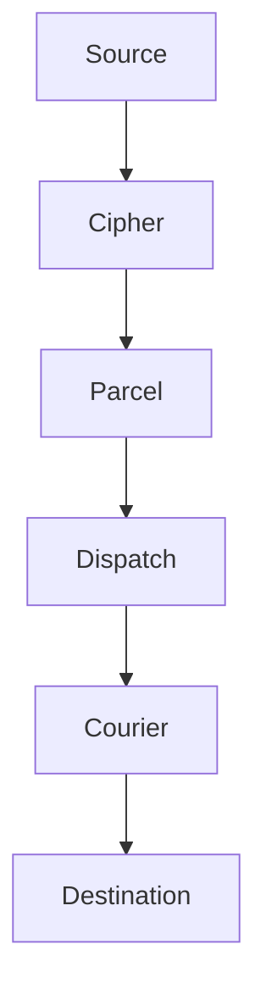

import { Terminology } from '@cbnventures/docusaurus-preset-nova/blocks';

# Overview

<Terminology title="Protocol translator and relay engine between systems" to="/docs/terminology#envoy">Envoy</Terminology> is a protocol translator and <Terminology title="Single declared pipeline from a source to destinations" to="/docs/terminology#relay">relay</Terminology> engine for systems that were never designed to understand each other. It sits between any two services, learns how they speak, transforms the message, and delivers it — without either side knowing there is an interpreter in the room.

No shared format. No shared protocol. No bilateral agreement. Just delivery.

> Integration should not require both sides to agree on a format. If both sides need to change, you have not solved the integration problem — you have created a new one.

## How It Works

Every message passes through five stages: authenticate, inspect, transform, route, deliver. The <Terminology title="Config file declaring every relay Envoy runs" to="/docs/terminology#relay-manifest-grain">relay manifest</Terminology> declares the rules. <Terminology title="Protocol translator and relay engine between systems" to="/docs/terminology#envoy">Envoy</Terminology> handles the execution.



1. **<Terminology title="Envoy's authentication gateway verifying every request" to="/docs/terminology#cipher">Cipher</Terminology>** authenticates the source — HMAC signatures, bearer tokens, or IP allowlists.
2. **<Terminology title="Envoy's payload transformation pipeline normalizing messages" to="/docs/terminology#parcel">Parcel</Terminology>** inspects and transforms the payload into the format the destination expects.
3. **<Terminology title="Envoy's routing engine deciding message destinations" to="/docs/terminology#dispatch">Dispatch</Terminology>** routes the message to the correct destination based on content, source, or severity.
4. **<Terminology title="Envoy's guaranteed-delivery engine with retry backoff" to="/docs/terminology#courier">Courier</Terminology>** delivers with guaranteed retry, <Terminology title="Terminal state after Courier's retries are exhausted" to="/docs/terminology#dead-letter">dead-letter</Terminology> queues, and delivery receipts.

## The Tool Suite

| Tool                                                                                                                                     | Purpose                                                                                                                                                                                                                   |
|------------------------------------------------------------------------------------------------------------------------------------------|---------------------------------------------------------------------------------------------------------------------------------------------------------------------------------------------------------------------------|
| **<Terminology title="Envoy's routing engine deciding message destinations" to="/docs/terminology#dispatch">Dispatch</Terminology>**     | Intelligent routing engine — routes by content, source, or severity.                                                                                                                                                      |
| **<Terminology title="Envoy's guaranteed-delivery engine with retry backoff" to="/docs/terminology#courier">Courier</Terminology>**      | Guaranteed-delivery retry engine — exponential backoff, <Terminology title="Terminal state after Courier's retries are exhausted" to="/docs/terminology#dead-letter">dead-letter</Terminology> queues, delivery receipts. |
| **<Terminology title="Envoy's payload transformation pipeline normalizing messages" to="/docs/terminology#parcel">Parcel</Terminology>** | Payload transformation pipeline — rewrites messages between formats.                                                                                                                                                      |
| **<Terminology title="Envoy's authentication gateway verifying every request" to="/docs/terminology#cipher">Cipher</Terminology>**       | Authentication gateway — HMAC signatures, bearer tokens, IP allowlists.                                                                                                                                                   |
| **<Terminology title="Append-only audit log of every message's state" to="/docs/terminology#ledger">Ledger</Terminology>**               | Full delivery audit trail — every message received, transformed, routed, delivered.                                                                                                                                       |
| **<Terminology title="Envoy's origin-masking reverse proxy exposed publicly" to="/docs/terminology#embassy">Embassy</Terminology>**      | Origin-masking reverse proxy — keeps internal services off the public internet.                                                                                                                                           |

:::info Minimal Footprint
<Terminology title="Protocol translator and relay engine between systems" to="/docs/terminology#envoy">Envoy</Terminology> ships as a single 3MB <Terminology title="Container image format Envoy ships as" to="/docs/terminology#vial">Vial</Terminology> image with zero external dependencies. Every protocol handler, transformation engine, and retry mechanism is built in. Nothing is pulled from the outside at build time or runtime.
:::

## Quick Start

Pull the <Terminology title="Container image format Envoy ships as" to="/docs/terminology#vial">Vial</Terminology> image and start the <Terminology title="Single declared pipeline from a source to destinations" to="/docs/terminology#relay">relay</Terminology>:

```bash title="Start Envoy"
vial pull envoy
vial run envoy --port 8090
```

Send a test message through the <Terminology title="Single declared pipeline from a source to destinations" to="/docs/terminology#relay">relay</Terminology>:

```bash title="Test delivery"
curl -X POST http://localhost:8090/relay/test-topic \
  -H "Content-Type: application/json" \
  -H "Authorization: Bearer your-relay-token" \
  -d '{"title": "Hello", "message": "Relay is operational."}'
```

The message is authenticated by <Terminology title="Envoy's authentication gateway verifying every request" to="/docs/terminology#cipher">Cipher</Terminology>, transformed by <Terminology title="Envoy's payload transformation pipeline normalizing messages" to="/docs/terminology#parcel">Parcel</Terminology> (if rules match), routed by <Terminology title="Envoy's routing engine deciding message destinations" to="/docs/terminology#dispatch">Dispatch</Terminology>, and delivered by <Terminology title="Envoy's guaranteed-delivery engine with retry backoff" to="/docs/terminology#courier">Courier</Terminology>. <Terminology title="Append-only audit log of every message's state" to="/docs/terminology#ledger">Ledger</Terminology> records the full transaction.

## Next Steps

- [Installation](/docs/setup/installation/) — <Terminology title="Container image format Envoy ships as" to="/docs/terminology#vial">Vial</Terminology>, <Terminology title="CLI used to install and run Envoy" to="/docs/terminology#spark">Spark</Terminology>, and <Terminology title="Orchestrated cluster deployment target for Envoy" to="/docs/terminology#trellis">Trellis</Terminology> deployment options.
- [Your First Relay](/docs/setup/your-first-relay/) — Receive a <Terminology title="Source code hosting platform with a built-in translator" to="/docs/terminology#threadbare">Threadbare</Terminology> webhook, transform it, deliver it to <Terminology title="Uptime monitoring service used as an example destination" to="/docs/terminology#canary">Canary</Terminology>.
- [Configuration](/docs/setup/configuration/) — The `.grain` <Terminology title="Config file declaring every relay Envoy runs" to="/docs/terminology#relay-manifest-grain">relay manifest</Terminology> in depth.
- [API Reference](/docs/reference/api-reference/) — Full <Terminology title="HTTP API Envoy exposes for relay management" to="/docs/terminology#spoke">Spoke</Terminology> API reference for <Terminology title="Single declared pipeline from a source to destinations" to="/docs/terminology#relay">relay</Terminology> management.
