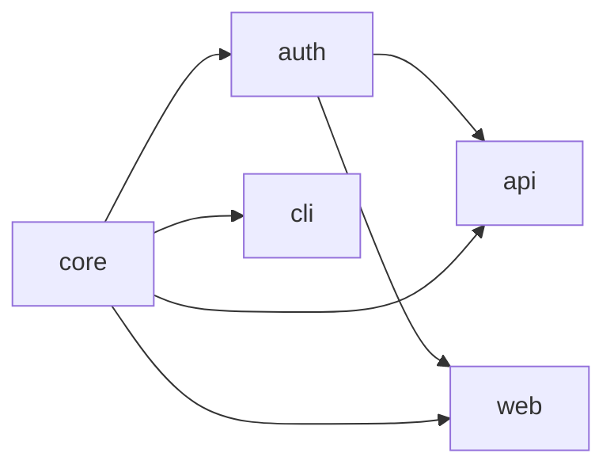

import Details from '@theme/Details';
import { Terminology } from '@cbnventures/docusaurus-preset-nova/blocks';

# Workspace Model

A Foundry <Terminology title="Foundry project declared in a .grain manifest" to="/docs/terminology#workspace">workspace</Terminology> is a tree of subprojects bound together by one <Terminology title="Single source of truth for a Foundry workspace" to="/docs/terminology#grain-manifest">`.grain` manifest</Terminology>. The manifest is the source of truth — Foundry never infers structure from directory layout or implicit conventions.

Every package, dependency, and build rule must be declared explicitly.

This document describes how Foundry thinks about a <Terminology title="Foundry project declared in a .grain manifest" to="/docs/terminology#workspace">workspace</Terminology>: what the manifest contains, how <Terminology title="Resolves the dependency graph with query tools" to="/docs/terminology#tongs">Tongs</Terminology> builds the dependency graph, and how <Terminology title="Running foundry ignite to generate workspace artifacts" to="/docs/terminology#forge--ignite">Forge</Terminology> resolves cross-<Terminology title="Foundry project declared in a .grain manifest" to="/docs/terminology#workspace">workspace</Terminology> references during a build.

## The Grain Manifest

Every <Terminology title="Foundry project declared in a .grain manifest" to="/docs/terminology#workspace">workspace</Terminology> has exactly one root manifest named `project.grain`. The manifest declares the <Terminology title="Foundry project declared in a .grain manifest" to="/docs/terminology#workspace">workspace</Terminology> identity, the language, the <Terminology title="Foundry's linting engine with 380+ rules" to="/docs/terminology#warden">Warden</Terminology> preset, and the package layout.

```text title="project.grain"
workspace "platform" {
  lang   = "alloy"
  warden = ["strict", "conventions"]

  packages {
    core    { type = "library" }
    auth    { type = "library", depends = ["core"] }
    api     { type = "service", depends = ["core", "auth"] }
    web     { type = "app",     depends = ["core", "auth"] }
    cli     { type = "binary",  depends = ["core"] }
  }
}
```

Foundry parses this manifest into an in-memory representation called the **workspace model**. Every downstream tool — <Terminology title="Running foundry ignite to generate workspace artifacts" to="/docs/terminology#forge--ignite">Forge</Terminology>, <Terminology title="Resolves the dependency graph with query tools" to="/docs/terminology#tongs">Tongs</Terminology>, <Terminology title="Content-addressable build cache skipping unchanged packages" to="/docs/terminology#quench">Quench</Terminology>, <Terminology title="Generates test scaffolds from exported type signatures" to="/docs/terminology#crucible">Crucible</Terminology>, <Terminology title="Foundry's linting engine with 380+ rules" to="/docs/terminology#warden">Warden</Terminology> — operates against the workspace model, not the raw text.

:::info
The workspace model is immutable for the duration of a <Terminology title="Running foundry ignite to generate workspace artifacts" to="/docs/terminology#forge--ignite">Forge</Terminology> run. If you edit the manifest while a build is in progress, the running build completes with the original model.

Re-run `foundry ignite` to pick up the changes.
:::

## Subprojects and Package Roles

Each package block declares one subproject. Foundry recognises four package types, and each type maps to a specific role in the <Terminology title="Foundry project declared in a .grain manifest" to="/docs/terminology#workspace">workspace</Terminology>.

| Type      | Role                                      | Build Output                                                                                                                                            |
|-----------|-------------------------------------------|---------------------------------------------------------------------------------------------------------------------------------------------------------|
| `library` | Reusable code consumed by other packages. | Compiled module + <Terminology title="Resolves the dependency graph with query tools" to="/docs/terminology#tongs">Tongs</Terminology> index.           |
| `service` | Long-running process with a Spoke API.    | Service bundle + Spoke descriptor.                                                                                                                      |
| `app`     | User-facing application.                  | <Terminology title="Compiler turning package source into build output" to="/docs/terminology#smelter">Smelter</Terminology> bundle + static asset tree. |
| `binary`  | Standalone CLI tool.                      | Executable + entry point manifest.                                                                                                                      |

A subproject's directory is named after its package and lives under the <Terminology title="Foundry project declared in a .grain manifest" to="/docs/terminology#workspace">workspace</Terminology> root. Foundry refuses to <Terminology title="Running foundry ignite to generate workspace artifacts" to="/docs/terminology#forge--ignite">forge</Terminology> if a declared package has no directory, or if a directory exists without a corresponding declaration.

## The Tongs Dependency Graph

<Terminology title="Resolves the dependency graph with query tools" to="/docs/terminology#tongs">Tongs</Terminology> is Foundry's dependency resolver. It reads the `depends` directive of every package and constructs a directed acyclic graph (DAG) of the <Terminology title="Foundry project declared in a .grain manifest" to="/docs/terminology#workspace">workspace</Terminology>.



<Terminology title="Resolves the dependency graph with query tools" to="/docs/terminology#tongs">Tongs</Terminology> uses this graph for three purposes:

1. **Build ordering.** <Terminology title="Running foundry ignite to generate workspace artifacts" to="/docs/terminology#forge--ignite">Forge</Terminology> processes packages in topological order so dependencies are ready before dependents start compiling.
2. **Change propagation.** When a package changes, <Terminology title="Resolves the dependency graph with query tools" to="/docs/terminology#tongs">Tongs</Terminology> marks every downstream dependent as stale.
3. **Cycle detection.** <Terminology title="Resolves the dependency graph with query tools" to="/docs/terminology#tongs">Tongs</Terminology> rejects any manifest that introduces a cycle, with a precise error path.

```bash title="Visualize the graph"
foundry tongs graph
```

```text title="Output"
workspace "platform"
  core      (library)  → consumed by: auth, api, web, cli
  auth      (library)  → consumed by: api, web
  api       (service)  → consumes: core, auth
  web       (app)      → consumes: core, auth
  cli       (binary)   → consumes: core

  5 packages, 6 edges, 0 cycles
```

### Cycle Rejection

A cycle in the dependency graph makes the build order undefined. <Terminology title="Resolves the dependency graph with query tools" to="/docs/terminology#tongs">Tongs</Terminology> detects cycles during the parse phase and refuses to continue.

```text title="Cycle error"
$ foundry ignite
ERROR: Dependency cycle detected
  api → auth → api

Fix: Remove the 'depends = ["api"]' directive from package "auth".
```

:::warning
<Terminology title="Resolves the dependency graph with query tools" to="/docs/terminology#tongs">Tongs</Terminology> only inspects the declared `depends` array. If a package imports another package at the source level without declaring the dependency, the import will fail at compile time but the cycle check will pass.

Always keep the manifest aligned with the actual imports.
:::

## Cross-Workspace Resolution

Some organisations split a product across multiple Foundry <Terminology title="Foundry project declared in a .grain manifest" to="/docs/terminology#workspace">workspaces</Terminology> — for example, a public SDK <Terminology title="Foundry project declared in a .grain manifest" to="/docs/terminology#workspace">workspace</Terminology> and a private platform <Terminology title="Foundry project declared in a .grain manifest" to="/docs/terminology#workspace">workspace</Terminology> that consumes the SDK. <Terminology title="Running foundry ignite to generate workspace artifacts" to="/docs/terminology#forge--ignite">Forge</Terminology> resolves cross-<Terminology title="Foundry project declared in a .grain manifest" to="/docs/terminology#workspace">workspace</Terminology> references through the `consume` directive.

```text title="project.grain — consuming an external workspace"
workspace "platform" {
  consume "sdk" from "../sdk/project.grain"

  packages {
    core { type = "library" }
    api  { type = "service", depends = ["core", "sdk:client"] }
  }
}
```

When <Terminology title="Running foundry ignite to generate workspace artifacts" to="/docs/terminology#forge--ignite">Forge</Terminology> encounters a `consume` directive, <Terminology title="Resolves the dependency graph with query tools" to="/docs/terminology#tongs">Tongs</Terminology> loads the external <Terminology title="Foundry project declared in a .grain manifest" to="/docs/terminology#workspace">workspace</Terminology>'s manifest, builds its dependency graph, and merges the relevant packages into the local graph. The `sdk:` prefix becomes a namespace — every reference to an external package must be qualified.

| Phase                                                                                                                        | Local Workspace                                                                                                                            | Consumed Workspace                                                                                                                                                                                                                                                                 |
|------------------------------------------------------------------------------------------------------------------------------|--------------------------------------------------------------------------------------------------------------------------------------------|------------------------------------------------------------------------------------------------------------------------------------------------------------------------------------------------------------------------------------------------------------------------------------|
| Parse                                                                                                                        | Always loaded.                                                                                                                             | Loaded on first `consume` directive.                                                                                                                                                                                                                                               |
| Build                                                                                                                        | Always rebuilt.                                                                                                                            | Rebuilt only if source changed.                                                                                                                                                                                                                                                    |
| Cache                                                                                                                        | Local <Terminology title="Content-addressable build cache skipping unchanged packages" to="/docs/terminology#quench">Quench</Terminology>. | Shared <Terminology title="Content-addressable build cache skipping unchanged packages" to="/docs/terminology#quench">Quench</Terminology>, scoped by <Terminology title="Foundry project declared in a .grain manifest" to="/docs/terminology#workspace">workspace</Terminology>. |
| <Terminology title="Foundry's linting engine with 380+ rules" to="/docs/terminology#warden">Warden</Terminology> enforcement | Local rules.                                                                                                                               | External rules apply unchanged.                                                                                                                                                                                                                                                    |

:::tip
Consumed <Terminology title="Foundry project declared in a .grain manifest" to="/docs/terminology#workspace">workspaces</Terminology> are built into a separate <Terminology title="Content-addressable build cache skipping unchanged packages" to="/docs/terminology#quench">Quench</Terminology> namespace so a downstream <Terminology title="Foundry project declared in a .grain manifest" to="/docs/terminology#workspace">workspace</Terminology> cannot pollute the upstream cache. This means a single SDK build can be reused across every consuming <Terminology title="Foundry project declared in a .grain manifest" to="/docs/terminology#workspace">workspace</Terminology> on the same machine.
:::

## Workspace Identity

The <Terminology title="Foundry project declared in a .grain manifest" to="/docs/terminology#workspace">workspace</Terminology> name has two effects beyond display:

- It prefixes every <Terminology title="Resolves the dependency graph with query tools" to="/docs/terminology#tongs">Tongs</Terminology> identifier (e.g. `platform:auth`), preventing collisions when two <Terminology title="Foundry project declared in a .grain manifest" to="/docs/terminology#workspace">workspaces</Terminology> are consumed together.
- It seeds the <Terminology title="Content-addressable build cache skipping unchanged packages" to="/docs/terminology#quench">Quench</Terminology> cache namespace, so the same package name in two <Terminology title="Foundry project declared in a .grain manifest" to="/docs/terminology#workspace">workspaces</Terminology> never shares cached artifacts.

Rename a <Terminology title="Foundry project declared in a .grain manifest" to="/docs/terminology#workspace">workspace</Terminology> and Foundry will treat it as new — every package rebuilds from scratch. Rename packages within a stable <Terminology title="Foundry project declared in a .grain manifest" to="/docs/terminology#workspace">workspace</Terminology> and only the renamed packages and their dependents rebuild.

<Details>
<summary>Workspace model invariants</summary>

| Invariant                                                                                                                                                      | Enforced By                                                                                                                                 |
|----------------------------------------------------------------------------------------------------------------------------------------------------------------|---------------------------------------------------------------------------------------------------------------------------------------------|
| Exactly one root manifest per <Terminology title="Foundry project declared in a .grain manifest" to="/docs/terminology#workspace">workspace</Terminology>.     | <Terminology title="Running foundry ignite to generate workspace artifacts" to="/docs/terminology#forge--ignite">Forge</Terminology> parse. |
| Every declared package has a directory.                                                                                                                        | <Terminology title="Running foundry ignite to generate workspace artifacts" to="/docs/terminology#forge--ignite">Forge</Terminology> parse. |
| No cycles in the dependency graph.                                                                                                                             | <Terminology title="Resolves the dependency graph with query tools" to="/docs/terminology#tongs">Tongs</Terminology>.                       |
| All `depends` entries resolve to known packages.                                                                                                               | <Terminology title="Resolves the dependency graph with query tools" to="/docs/terminology#tongs">Tongs</Terminology>.                       |
| Cross-<Terminology title="Foundry project declared in a .grain manifest" to="/docs/terminology#workspace">workspace</Terminology> references are namespaced.   | <Terminology title="Resolves the dependency graph with query tools" to="/docs/terminology#tongs">Tongs</Terminology>.                       |
| Package names are unique within a <Terminology title="Foundry project declared in a .grain manifest" to="/docs/terminology#workspace">workspace</Terminology>. | <Terminology title="Running foundry ignite to generate workspace artifacts" to="/docs/terminology#forge--ignite">Forge</Terminology> parse. |

</Details>

## Next Steps

- [Incremental Builds](/docs/core/incremental-builds/) — How <Terminology title="Content-addressable build cache skipping unchanged packages" to="/docs/terminology#quench">Quench</Terminology> caches artifacts so the next <Terminology title="Running foundry ignite to generate workspace artifacts" to="/docs/terminology#forge--ignite">forge</Terminology> only rebuilds what changed.
- [Manifests](/docs/guides/manifests/) — Full directive reference for the `.grain` syntax.
- [Build Pipeline](/docs/pipeline/build-pipeline/) — How <Terminology title="Running foundry ignite to generate workspace artifacts" to="/docs/terminology#forge--ignite">Forge</Terminology> moves the workspace model through compile, link, and verify stages.
