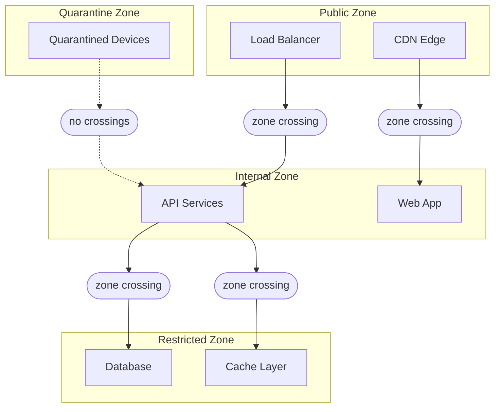

import { Terminology } from '@cbnventures/docusaurus-preset-nova/blocks';

# Micro-Segmentation

<Terminology title="Micro-segmentation layer isolating workloads into zones" to="/docs/terminology#rampart">Rampart</Terminology> is Sentinel's micro-segmentation layer. It isolates workloads into discrete <Terminology title="Rampart-defined workload boundary needing a crossing rule" to="/docs/terminology#zone">zones</Terminology> so that lateral movement between them is impossible by default. Even if an attacker compromises one <Terminology title="Rampart-defined workload boundary needing a crossing rule" to="/docs/terminology#zone">zone</Terminology>, the breach is contained. No <Terminology title="Rampart-defined workload boundary needing a crossing rule" to="/docs/terminology#zone">zone</Terminology> trusts any other <Terminology title="Rampart-defined workload boundary needing a crossing rule" to="/docs/terminology#zone">zone</Terminology> without an explicit, policy-evaluated crossing rule.

## Zone Architecture

<Terminology title="Micro-segmentation layer isolating workloads into zones" to="/docs/terminology#rampart">Rampart</Terminology> divides your infrastructure into four <Terminology title="Rampart-defined workload boundary needing a crossing rule" to="/docs/terminology#zone">zone</Terminology> types, each with different default trust properties:



| Zone Type      | Default Trust | Inbound                                                                                                                                                    | Outbound                                                                                                                                                     |
|----------------|---------------|------------------------------------------------------------------------------------------------------------------------------------------------------------|--------------------------------------------------------------------------------------------------------------------------------------------------------------|
| **Public**     | None          | External traffic allowed                                                                                                                                   | Internal <Terminology title="Rampart-defined workload boundary needing a crossing rule" to="/docs/terminology#zone">zones</Terminology> via crossing rules   |
| **Internal**   | Low           | Public <Terminology title="Rampart-defined workload boundary needing a crossing rule" to="/docs/terminology#zone">zones</Terminology> via crossing rules   | Restricted <Terminology title="Rampart-defined workload boundary needing a crossing rule" to="/docs/terminology#zone">zones</Terminology> via crossing rules |
| **Restricted** | None          | Internal <Terminology title="Rampart-defined workload boundary needing a crossing rule" to="/docs/terminology#zone">zones</Terminology> via crossing rules | No outbound allowed by default                                                                                                                               |
| **Quarantine** | None          | No inbound allowed                                                                                                                                         | No outbound allowed                                                                                                                                          |

## Defining Zones

<Terminology title="Rampart-defined workload boundary needing a crossing rule" to="/docs/terminology#zone">Zones</Terminology> are declared in <Terminology title="Declarative file format for trust policies and profiles" to="/docs/terminology#grain-format">`.grain` format</Terminology> and applied to workloads by resource tag:

```text title="zones/production.grain"
zone "api-services" {
  type     = "internal"
  workloads = ["api-east-*", "api-west-*"]

  ingress {
    allow_from = ["public-edge"]
    require_policy = "api-access"
  }

  egress {
    allow_to = ["data-layer"]
    require_policy = "data-access"
  }
}

zone "data-layer" {
  type     = "restricted"
  workloads = ["db-primary", "db-replica-*", "cache-*"]

  ingress {
    allow_from = ["api-services"]
    require_policy = "data-access"
  }

  egress {
    allow_to = []
  }
}
```

Every <Terminology title="Rampart-defined workload boundary needing a crossing rule" to="/docs/terminology#zone">zone</Terminology> crossing requires both a structural rule (the `ingress`/`egress` declarations) and a trust policy evaluation. Even if the structural rule allows the crossing, <Terminology title="Adaptive access gateway granting or revoking access" to="/docs/terminology#drawbridge">Drawbridge</Terminology> still evaluates the specified policy before opening the <Terminology title="Tunnel protocol connecting an agent to the control plane" to="/docs/terminology#filament">Filament</Terminology> tunnel.

## Lateral Movement Prevention

Lateral movement occurs when an attacker moves from one compromised system to another within the network. In a flat network, every system can reach every other system. In a <Terminology title="Micro-segmentation layer isolating workloads into zones" to="/docs/terminology#rampart">Rampart</Terminology>-segmented network, every hop requires a <Terminology title="Rampart-defined workload boundary needing a crossing rule" to="/docs/terminology#zone">zone</Terminology> crossing — and every <Terminology title="Rampart-defined workload boundary needing a crossing rule" to="/docs/terminology#zone">zone</Terminology> crossing requires a policy evaluation.

Consider an attacker who compromises a service in the `api-services` <Terminology title="Rampart-defined workload boundary needing a crossing rule" to="/docs/terminology#zone">zone</Terminology>:

| Attack Path             | Flat Network  | Rampart Segmented                                                                                                                                        |
|-------------------------|---------------|----------------------------------------------------------------------------------------------------------------------------------------------------------|
| API → Database          | Direct access | <Terminology title="Rampart-defined workload boundary needing a crossing rule" to="/docs/terminology#zone">Zone</Terminology> crossing — policy required |
| API → Admin tools       | Direct access | No crossing rule — blocked                                                                                                                               |
| API → Other API service | Direct access | Same <Terminology title="Rampart-defined workload boundary needing a crossing rule" to="/docs/terminology#zone">zone</Terminology> — allowed             |
| API → Control plane     | Direct access | No crossing rule — blocked                                                                                                                               |

The attacker can reach other services within the same <Terminology title="Rampart-defined workload boundary needing a crossing rule" to="/docs/terminology#zone">zone</Terminology> but cannot escape it. There is no crossing rule from `api-services` to `admin-tools` or `control-plane`, so the <Terminology title="Tunnel protocol connecting an agent to the control plane" to="/docs/terminology#filament">Filament</Terminology> tunnel request is rejected before it reaches <Terminology title="Adaptive access gateway granting or revoking access" to="/docs/terminology#drawbridge">Drawbridge</Terminology>.

:::warning Zone Granularity
Over-segmentation creates operational friction. Under-segmentation increases blast radius. The recommended approach is to segment by trust level and data sensitivity, not by team or service name. A <Terminology title="Rampart-defined workload boundary needing a crossing rule" to="/docs/terminology#zone">zone</Terminology> should contain workloads that trust each other, and nothing else.
:::

## Zone Crossing Rules

Crossing rules define the structural path between <Terminology title="Rampart-defined workload boundary needing a crossing rule" to="/docs/terminology#zone">zones</Terminology>. They do not grant access — they enable <Terminology title="Adaptive access gateway granting or revoking access" to="/docs/terminology#drawbridge">Drawbridge</Terminology> to evaluate a policy for that path:

```text title="crossings/api-to-data.grain"
crossing "api-to-data" {
  source = "api-services"
  target = "data-layer"
  policy = "data-access"

  constraints {
    max_concurrent = 100
    timeout        = 30
    protocol       = ["filament"]
  }
}
```

The `max_concurrent` constraint limits the number of simultaneous <Terminology title="Tunnel protocol connecting an agent to the control plane" to="/docs/terminology#filament">Filament</Terminology> tunnels between the two <Terminology title="Rampart-defined workload boundary needing a crossing rule" to="/docs/terminology#zone">zones</Terminology>. The `timeout` closes idle tunnels after 30 seconds. These constraints operate independently of the trust policy — they are structural limits on the <Terminology title="Rampart-defined workload boundary needing a crossing rule" to="/docs/terminology#zone">zone</Terminology> boundary.

## Quarantine Zone

Devices that fail a <Terminology title="Endpoint compliance engine that enrolls and enforces device policy" to="/docs/terminology#garrison">Garrison</Terminology> compliance check or fall below the minimum posture threshold are automatically moved to the quarantine <Terminology title="Rampart-defined workload boundary needing a crossing rule" to="/docs/terminology#zone">zone</Terminology>. Quarantined devices cannot reach any other <Terminology title="Rampart-defined workload boundary needing a crossing rule" to="/docs/terminology#zone">zone</Terminology>:

```text title="Quarantine output"
Garrison posture check: dev_a9c1e3f5b7d4
  Posture score: 62 (threshold: 80)
  Failing checks:
    - OS patch level: 47 days stale (max: 30)
    - Antivirus definitions: 12 days stale (max: 3)

  Action: device moved to quarantine zone
  Access: all Filament tunnels terminated
  Remediation: update OS patches and antivirus definitions
```

The device remains in quarantine until <Terminology title="Endpoint compliance engine that enrolls and enforces device policy" to="/docs/terminology#garrison">Garrison</Terminology> confirms that all <Terminology title="Minimum posture requirements a device group must meet" to="/docs/terminology#compliance-profile">compliance profile</Terminology> requirements are met. At that point, the device is returned to its original <Terminology title="Rampart-defined workload boundary needing a crossing rule" to="/docs/terminology#zone">zone</Terminology> and the next <Terminology title="Continuous posture assessment engine computing the trust score" to="/docs/terminology#watchtower">Watchtower</Terminology> evaluation proceeds normally.

## Next Steps

- [Audit & Forensics](/docs/operations/audit-forensics/) — How <Terminology title="Audit and forensics component with 7-year log retention" to="/docs/terminology#spyglass">Spyglass</Terminology> records <Terminology title="Rampart-defined workload boundary needing a crossing rule" to="/docs/terminology#zone">zone</Terminology> crossing events and tunnel activity.
- [Policy Simulation](/docs/operations/policy-simulation/) — Test <Terminology title="Rampart-defined workload boundary needing a crossing rule" to="/docs/terminology#zone">zone</Terminology> topology changes with <Terminology title="Policy simulation sandbox testing rules before enforcement" to="/docs/terminology#parapet">Parapet</Terminology> before deploying.
- [Access Control](/docs/trust/access-control/) — How <Terminology title="Adaptive access gateway granting or revoking access" to="/docs/terminology#drawbridge">Drawbridge</Terminology> evaluates crossing policies.
