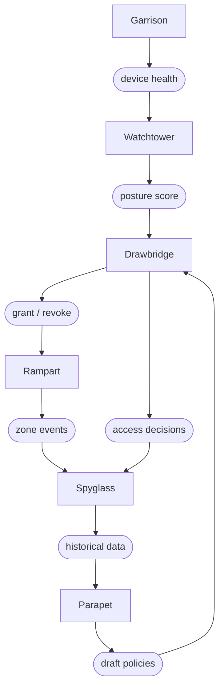

import { Terminology } from '@cbnventures/docusaurus-preset-nova/blocks';

# Platform Overview

Sentinel is a trust engine for distributed teams. It continuously evaluates whether a person, device, and context should still have access — and revokes it the moment the answer changes. Access is not a door you open once. It is a conversation that never ends.

> "The perimeter dissolved years ago. We stopped pretending it had not."

## Architecture

The Sentinel platform consists of six components that operate as a continuous trust loop. <Terminology title="Continuous posture assessment engine computing the trust score" to="/docs/terminology#watchtower">Watchtower</Terminology> observes, <Terminology title="Adaptive access gateway granting or revoking access" to="/docs/terminology#drawbridge">Drawbridge</Terminology> enforces, <Terminology title="Endpoint compliance engine that enrolls and enforces device policy" to="/docs/terminology#garrison">Garrison</Terminology> manages endpoints, <Terminology title="Micro-segmentation layer isolating workloads into zones" to="/docs/terminology#rampart">Rampart</Terminology> segments workloads, <Terminology title="Audit and forensics component with 7-year log retention" to="/docs/terminology#spyglass">Spyglass</Terminology> audits, and <Terminology title="Policy simulation sandbox testing rules before enforcement" to="/docs/terminology#parapet">Parapet</Terminology> simulates.

## Components

| Component                                                                                                                                          | Purpose                                                                                                                                                                                                                 |
|----------------------------------------------------------------------------------------------------------------------------------------------------|-------------------------------------------------------------------------------------------------------------------------------------------------------------------------------------------------------------------------|
| **<Terminology title="Continuous posture assessment engine computing the trust score" to="/docs/terminology#watchtower">Watchtower</Terminology>** | Continuous posture assessment — evaluates device health, location, and behavior every 90 seconds.                                                                                                                       |
| **<Terminology title="Adaptive access gateway granting or revoking access" to="/docs/terminology#drawbridge">Drawbridge</Terminology>**            | Adaptive access gateway — grants, narrows, or revokes access in real time based on context.                                                                                                                             |
| **<Terminology title="Endpoint compliance engine that enrolls and enforces device policy" to="/docs/terminology#garrison">Garrison</Terminology>** | Endpoint compliance engine — enforces policy on every connected device before access is granted.                                                                                                                        |
| **<Terminology title="Micro-segmentation layer isolating workloads into zones" to="/docs/terminology#rampart">Rampart</Terminology>**              | Micro-segmentation layer — isolates workloads so lateral movement between <Terminology title="Rampart-defined workload boundary needing a crossing rule" to="/docs/terminology#zone">zones</Terminology> is impossible. |
| **<Terminology title="Audit and forensics component with 7-year log retention" to="/docs/terminology#spyglass">Spyglass</Terminology>**            | Audit and forensics — full session reconstruction with 7-year immutable log retention.                                                                                                                                  |
| **<Terminology title="Policy simulation sandbox testing rules before enforcement" to="/docs/terminology#parapet">Parapet</Terminology>**           | Policy simulation sandbox — test access rules against real traffic before enforcing them.                                                                                                                               |

## How It Works

Every access decision in Sentinel follows the same cycle:

1. **<Terminology title="Endpoint compliance engine that enrolls and enforces device policy" to="/docs/terminology#garrison">Garrison</Terminology>** reports device posture — OS version, disk encryption, firewall status, patch level.
2. **<Terminology title="Continuous posture assessment engine computing the trust score" to="/docs/terminology#watchtower">Watchtower</Terminology>** computes a <Terminology title="Watchtower's composite evaluation of session trustworthiness" to="/docs/terminology#trust-score">trust score</Terminology> from device posture, user identity, network context, and behavioral signals.
3. **<Terminology title="Adaptive access gateway granting or revoking access" to="/docs/terminology#drawbridge">Drawbridge</Terminology>** evaluates the <Terminology title="Watchtower's composite evaluation of session trustworthiness" to="/docs/terminology#trust-score">trust score</Terminology> against the applicable policy and grants, narrows, or revokes access.
4. **<Terminology title="Micro-segmentation layer isolating workloads into zones" to="/docs/terminology#rampart">Rampart</Terminology>** enforces <Terminology title="Rampart-defined workload boundary needing a crossing rule" to="/docs/terminology#zone">zone</Terminology> boundaries so that granted access is scoped to the correct workload segment.
5. **<Terminology title="Audit and forensics component with 7-year log retention" to="/docs/terminology#spyglass">Spyglass</Terminology>** records the entire decision chain — immutably, for seven years.
6. This cycle repeats every 90 seconds for every active session.

:::info Continuous, Not Periodic
Sentinel does not check trust once at login. It re-evaluates every active session every 90 seconds. If a device falls out of compliance mid-session, access is revoked before the next request completes.
:::

## Trust Score

The <Terminology title="Watchtower's composite evaluation of session trustworthiness" to="/docs/terminology#trust-score">trust score</Terminology> is computed from four weighted signal categories:

| Category               | Weight | Signals                                               |
|------------------------|--------|-------------------------------------------------------|
| **Device posture**     | 40%    | OS version, disk encryption, firewall, patch level    |
| **User identity**      | 30%    | Authentication strength, MFA enrollment, account risk |
| **Network context**    | 20%    | Source IP reputation, geolocation, connection type    |
| **Behavioral signals** | 10%    | Access pattern anomalies, data volume, time-of-day    |

Policies define a minimum score threshold. If the composite score drops below the threshold, <Terminology title="Adaptive access gateway granting or revoking access" to="/docs/terminology#drawbridge">Drawbridge</Terminology> revokes access immediately and requires re-authentication.

## Next Steps

- [Installation](/docs/getting-started/installation/) — Deploy the Sentinel agent via <Terminology title="CLI used to install the Sentinel agent" to="/docs/terminology#spark">Spark</Terminology>, <Terminology title="Container runtime for running the Sentinel agent" to="/docs/terminology#vial">Vial</Terminology>, or <Terminology title="Cloud marketplace deployment target for Sentinel" to="/docs/terminology#arcline">Arcline</Terminology>.
- [Your First Policy](/docs/getting-started/your-first-policy/) — Write a trust policy and watch <Terminology title="Continuous posture assessment engine computing the trust score" to="/docs/terminology#watchtower">Watchtower</Terminology> evaluate it.
- [Trust Policies](/docs/trust/trust-policies/) — Policy grammar, conditions, composability, and inheritance chains.
- [API Reference](/docs/reference/api-reference/) — Full <Terminology title="Sentinel's REST API for policy and device management" to="/docs/terminology#spoke-api">Spoke API</Terminology> documentation for policy management and audit export.
