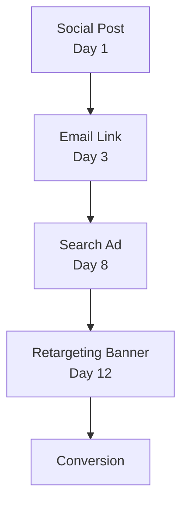

import Details from '@theme/Details';
import { Terminology } from '@cbnventures/docusaurus-preset-nova/blocks';

# Click Attribution

<Terminology title="Signal's multi-touch attribution engine tracing conversions" to="/docs/terminology#prism">Prism</Terminology> is Signal's <Terminology title="Credits every touchpoint across the full conversion path" to="/docs/terminology#multi-touch-attribution">multi-touch attribution</Terminology> engine. It traces the full conversion path across channels, assigns weighted credit to every <Terminology title="Single tracked interaction within an attribution path" to="/docs/terminology#touchpoint">touchpoint</Terminology>, and reconstructs the journey from first encounter to final action.

## The Problem with Single-Touch

Most attribution models credit one <Terminology title="Single tracked interaction within an attribution path" to="/docs/terminology#touchpoint">touchpoint</Terminology> — either the first click or the last click. Both are wrong.

A user who sees a social post, clicks an email link, revisits through a search ad, and finally converts from a retargeting banner is not a single-click story. It is a four-chapter narrative, and every chapter contributed.

<Terminology title="Signal's multi-touch attribution engine tracing conversions" to="/docs/terminology#prism">Prism</Terminology> captures all of it.

## Multi-Touch Attribution Path

When a user interacts with multiple <Terminology title="Short link carrying embedded attribution metadata" to="/docs/terminology#beacon">Beacon</Terminology> links across channels, <Terminology title="Signal's multi-touch attribution engine tracing conversions" to="/docs/terminology#prism">Prism</Terminology> builds an attribution path:



Each node is a <Terminology title="Short link carrying embedded attribution metadata" to="/docs/terminology#beacon">Beacon</Terminology> link with embedded <Terminology title="Unique identifier tying touchpoints into one path" to="/docs/terminology#trace">trace</Terminology> metadata. <Terminology title="Signal's multi-touch attribution engine tracing conversions" to="/docs/terminology#prism">Prism</Terminology> connects them into a single attribution chain by matching the user's fingerprint across <Terminology title="Single tracked interaction within an attribution path" to="/docs/terminology#touchpoint">touchpoints</Terminology>.

## Attribution Models

<Terminology title="Signal's multi-touch attribution engine tracing conversions" to="/docs/terminology#prism">Prism</Terminology> supports multiple attribution models. Choose the one that matches your business logic:

| Model        | Description                                                                                                                                                                           | Best For                       |
|--------------|---------------------------------------------------------------------------------------------------------------------------------------------------------------------------------------|--------------------------------|
| **Linear**   | Equal credit to every <Terminology title="Single tracked interaction within an attribution path" to="/docs/terminology#touchpoint">touchpoint</Terminology>.                          | Simple campaigns, baselines.   |
| **Decay**    | More credit to recent <Terminology title="Single tracked interaction within an attribution path" to="/docs/terminology#touchpoint">touchpoints</Terminology>. Configurable half-life. | Long sales cycles.             |
| **Position** | 40% to first touch, 40% to last touch, 20% split across the rest.                                                                                                                     | Brand + conversion campaigns.  |
| **Custom**   | Write your own weighting function in <Terminology title="Scripting language for custom attribution-weighting functions" to="/docs/terminology#alloy">Alloy</Terminology>.             | Complex multi-channel funnels. |

## Querying Attribution Paths

Query a specific <Terminology title="Unique identifier tying touchpoints into one path" to="/docs/terminology#trace">trace</Terminology> to see the full path:

```bash title="Query an attribution path"
signal prism path --trace "trc_8f3a1b2c4d5e6f70"
```

```json title="Multi-touch attribution output"
{
  "trace": "trc_8f3a1b2c4d5e6f70",
  "model": "decay",
  "halfLife": "7d",
  "touchpoints": [
    {
      "order": 1,
      "channel": "social",
      "campaign": "product-launch",
      "variant": "og-card",
      "timestamp": "2025-02-08T14:22:00Z",
      "weight": 0.12
    },
    {
      "order": 2,
      "channel": "email",
      "campaign": "product-launch",
      "variant": "hero-cta",
      "timestamp": "2025-02-10T09:15:00Z",
      "weight": 0.18
    },
    {
      "order": 3,
      "channel": "search",
      "campaign": "brand-terms",
      "variant": "headline-a",
      "timestamp": "2025-02-15T11:40:00Z",
      "weight": 0.28
    },
    {
      "order": 4,
      "channel": "retargeting",
      "campaign": "product-launch",
      "variant": "banner-300x250",
      "timestamp": "2025-02-19T16:05:00Z",
      "weight": 0.42
    }
  ],
  "conversion": {
    "event": "signup",
    "timestamp": "2025-02-19T16:08:32Z",
    "value": 49.00
  }
}
```

## Decay Curves

The <Terminology title="Attribution model weighting touchpoints near conversion" to="/docs/terminology#decay-model">decay model</Terminology> assigns more credit to <Terminology title="Single tracked interaction within an attribution path" to="/docs/terminology#touchpoint">touchpoints</Terminology> closer to the conversion. The half-life parameter controls how quickly earlier <Terminology title="Single tracked interaction within an attribution path" to="/docs/terminology#touchpoint">touchpoints</Terminology> lose credit:

| Half-Life | Effect                                                                                                                                                                                       |
|-----------|----------------------------------------------------------------------------------------------------------------------------------------------------------------------------------------------|
| `1d`      | Aggressive decay. Only the last day or two matter.                                                                                                                                           |
| `7d`      | Moderate decay. A full week of <Terminology title="Single tracked interaction within an attribution path" to="/docs/terminology#touchpoint">touchpoints</Terminology> get meaningful credit. |
| `30d`     | Gentle decay. Long nurture sequences retain credit.                                                                                                                                          |

```bash title="Set a decay model with 7-day half-life"
signal prism model set --model decay --half-life 7d --campaign "product-launch"
```

<Details>
<summary>How the decay algorithm works</summary>

<Terminology title="Signal's multi-touch attribution engine tracing conversions" to="/docs/terminology#prism">Prism</Terminology>'s <Terminology title="Attribution model weighting touchpoints near conversion" to="/docs/terminology#decay-model">decay model</Terminology> uses an exponential decay function. For each <Terminology title="Single tracked interaction within an attribution path" to="/docs/terminology#touchpoint">touchpoint</Terminology> at time `t` before the conversion, the raw weight is:

```text
weight(t) = e^(-lambda * t)
```

Where `lambda = ln(2) / halfLife`. After computing raw weights for all <Terminology title="Single tracked interaction within an attribution path" to="/docs/terminology#touchpoint">touchpoints</Terminology>, <Terminology title="Signal's multi-touch attribution engine tracing conversions" to="/docs/terminology#prism">Prism</Terminology> normalizes them so the total sums to 1.0.

For a 7-day half-life, a <Terminology title="Single tracked interaction within an attribution path" to="/docs/terminology#touchpoint">touchpoint</Terminology> from 7 days before conversion receives half the weight of a <Terminology title="Single tracked interaction within an attribution path" to="/docs/terminology#touchpoint">touchpoint</Terminology> at conversion time. A <Terminology title="Single tracked interaction within an attribution path" to="/docs/terminology#touchpoint">touchpoint</Terminology> from 14 days before receives one quarter.

The custom model lets you replace this function entirely with an <Terminology title="Scripting language for custom attribution-weighting functions" to="/docs/terminology#alloy">Alloy</Terminology> script that receives the <Terminology title="Single tracked interaction within an attribution path" to="/docs/terminology#touchpoint">touchpoint</Terminology> array and returns a weight array.

</Details>

## Channel Weighting

Override the base attribution model with channel-specific multipliers:

```bash title="Apply channel weights"
signal prism weights set \
  --campaign "product-launch" \
  --channel email=1.2 \
  --channel social=0.8 \
  --channel search=1.0 \
  --channel retargeting=0.9
```

Channel weights are applied after the base model calculates raw weights. A 1.2 multiplier on email means email <Terminology title="Single tracked interaction within an attribution path" to="/docs/terminology#touchpoint">touchpoints</Terminology> receive 20% more credit than the base model would assign.

## Next Steps

- [Campaign Management](/docs/campaigns/campaign-management/) — Snapshot campaign performance with <Terminology title="Point-in-time campaign performance snapshots over time" to="/docs/terminology#aperture">Aperture</Terminology>.
- [Audience Analysis](/docs/attribution/audience-analysis/) — Detect where audiences overlap with <Terminology title="Detects overlap between audience segments" to="/docs/terminology#resonance">Resonance</Terminology>.
